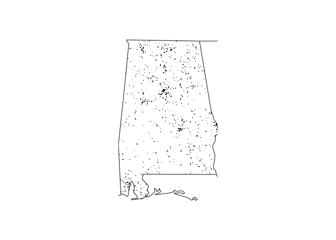

<!-- README.md is generated from README.Rmd. Please edit that file -->

# BuildingRPackagesAssignment

<!-- badges: start -->

[](https://travis-ci.org/pgarciamartinez/BuildingRPackagesAssignment)
<!-- badges: end -->

The goal of BuildingRPackagesAssignment is to generate a sample package
to pass an assignment from the course “Building R Packages” from the
Johns Hopkins University offered in Coursera.

## Installation

You can install the released version of BuildingRPackagesAssignment from
[CRAN](https://CRAN.R-project.org) with:

``` r
install.packages("BuildingRPackagesAssignment")
```

And the development version from [GitHub](https://github.com/) with:

``` r
# install.packages("devtools")
devtools::install_github("pgarciamartinez/BuildingRPackagesAssignment")
```

## Example

This is a basic example which shows you how to solve a common problem:

``` r
library(BuildingRPackagesAssignment)
## basic example code
fars_map_state(1, 2015)
```


What is special about using `README.Rmd` instead of just `README.md`?
You can include R chunks like so:

``` r
globalVariables(c("STATE", "MONTH", "year", "n"))
#> [1] "STATE" "MONTH" "year"  "n"
```

You’ll still need to render `README.Rmd` regularly, to keep `README.md`
up-to-date.

You can also embed plots, for example:



In that case, don’t forget to commit and push the resulting figure
files, so they display on GitHub\!
